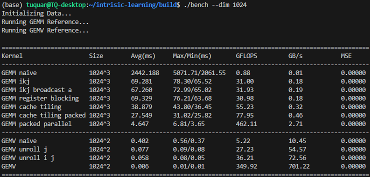

A project where i learn intrinsic stuffs, currently AVX2.

#### How to use
- I haven't add flags for MSVC yet, so run on WSL or Linux for now
```bash
mkdir build
cd build
cmake ..
cmake --build .
```
```bash
./bench --dim 512
```

#### Result
- The following result is from running benchmark on an i5-14500
